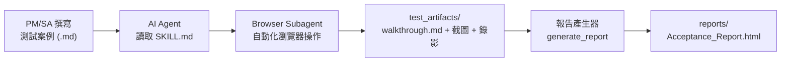

# 開發規格書：AI Agent 驅動之自動化驗收測試與報告生成系統

> **版本**：v2.0 | **更新日期**：2026-02-25  
> **前版**：[devSpec_v1.md](file:///d:/GitHub/AIGen/AutoTest/dev/devSpec_v1.md)（原始 Word 驅動構想）

---

## 1. 專案背景與目標

本專案旨在建立一套**零學習成本**的自動化測試與報告生成流程，讓 SA（系統分析師）與 PM（專案經理）能以自然語言撰寫測試案例（Markdown 格式），透過 AI Agent 自動執行網頁瀏覽器操作，並一鍵產出包含真實截圖與錄影的驗收測試報告。

### 設計原則
- **非工程人員友善**：PM/SA 只需關注 `Test/`（輸入）與 `reports/`（輸出）兩個資料夾
- **AI 驅動而非腳本驅動**：以自然語言描述步驟，由 AI 智慧映射 DOM 操作，無需寫死 CSS Selector
- **報告自包含**：產出的 HTML 報告內嵌所有圖片與影片，可獨立分享

---

## 2. 角色與職責

| 角色 | 職責 | 操作方式 |
|---|---|---|
| **PM / SA** | 維護測試劇本與預期結果 | 在 `Test/` 下用 Markdown 三段式結構撰寫測試案例 |
| **QA / 執行者** | 觸發測試、檢視報告 | 在 AI 對話輸入觸發關鍵字（如 `/test`、`執行驗收`） |
| **AI Agent** | 解讀步驟、操控瀏覽器 | 自動讀取 Markdown → 啟動 Browser Subagent 執行操作 |
| **報告產生器** | 彙整結果為可交付文件 | 將 `walkthrough.md` + 截圖/錄影打包為 HTML |

---

## 3. 系統核心流程



### 流程分解

1. **Input（案例讀取）**：AI Agent 載入 `autoTestReport` 技能，解析 PM/SA 指定的 `.md` 測試案例檔。
2. **Execution（自動化執行）**：AI Agent 呼叫 `browser_subagent`，將自然語言步驟智慧映射為瀏覽器操作（點擊、輸入、等待、檔案上傳等），全程自動錄影。
3. **Capture（截圖留存）**：依據 `自動化紀錄點` 標記，在關鍵步驟擷取網頁截圖，暫存於 `.agent/test_artifacts/`。
4. **Output（報告生成）**：執行 `generate_report` 將 `walkthrough.md` 轉為 HTML，圖片以 Base64 內嵌、影片附於報告底部，產出自包含的單檔報告。

---

## 4. 功能需求清單

### 功能一：Markdown 測試案例解析（已實現 ✅）

- 支援三段式結構：`[階段一]` 目標 → `[執行步驟]` 操作 → `[預期結果]` 驗證
- 支援結構化變數設定（URL、帳密、限制條件）
- 支援 `自動化紀錄點` 標記指定截圖時機

### 功能二：AI Agent 瀏覽器自動化（已實現 ✅）

- 透過 Antigravity `browser_subagent` 將自然語言映射至 DOM 操作
- 支援：點擊、文字輸入、等待載入、檔案上傳、下拉選單切換
- 具備異常路徑處理（如權限不足時自動切換資料重試）
- 全程 WebP 影片錄製

### 功能三：HTML 報告組裝模組（已實現 ✅）

- Markdown → HTML 轉換（支援 tables、fenced_code）
- 圖片 Base64 內嵌（支援 PNG/JPG/WebP/GIF）
- 影片嵌入（支援 WebM/MP4）
- 自適應的 CSS 專業排版

### 功能四：測試案例格式驗證（待開發 🔧）

- 檢查 `.md` 是否符合三段式結構
- 驗證必填欄位是否完整（URL、步驟編號、紀錄點）
- 輸出驗證結果供撰寫者即時修正

### 功能五：測試案例範本自動生成（待開發 🔧）

- PM/SA 輸入測試目標與 URL，自動產出符合三段式結構的 Markdown 範本
- 降低首次撰寫的認知負擔

### 功能六：批次測試執行（待開發 🔧）

- 一鍵掃描 `Test/` 資料夾下所有 `.md` 檔案
- 依序自動執行每份測試案例並個別產生報告
- 最終彙整為摘要儀表板（統計 Pass/Fail 數量）

### 功能七：Word 報告輸出支援（待開發 🔧，選配）

- 設計含 `[需截圖]` 標記的 `.docx` 範本
- 使用 `python-docx` 將截圖插入 Word 指定位置
- 保留原 Word 樣式與版面設定
- 支援 `--format html` / `--format docx` 雙軌輸出

---

## 5. 技術選型

| 類別 | 技術 | 用途 |
|---|---|---|
| **程式語言** | Python | 報告生成器、工具腳本 |
| **AI Agent** | Antigravity (Gemini) | 自然語言 → 瀏覽器操作智慧映射 |
| **瀏覽器自動化** | `browser_subagent` | Agent 內建的瀏覽器控制子代理 |
| **Markdown 轉換** | `markdown` (Python) | Markdown → HTML |
| **Word 處理** | `python-docx`（選配） | Word 報告組裝模組 |
| **報告打包** | PyInstaller | 編譯為 `.exe` 免依賴環境 |

---

## 6. 分階段開發步驟

### 第一階段：基礎整合優化（穩固核心流程）

> 目標：強化已實現功能的穩定度與可維護性

| # | 開發項目 | 說明 |
|---|---|---|
| 1-1 | 精簡 devSpec 文件 | 移除雜訊標記、對齊實際架構（即本文件） |
| 1-2 | SKILL.md 健壯性加強 | 加入 fallback 機制、超時重試、更明確的錯誤回報 |
| 1-3 | 報告產生器增強 | 支援更多 Markdown 擴展語法、改善 CSS 排版品質 |
| 1-4 | 測試案例格式驗證工具 | 新增 `validate_testcase.py` 確保 Markdown 結構正確 |

### 第二階段：智慧化增強（提升便捷性）

> 目標：降低使用門檻，支援大規模測試場景

| # | 開發項目 | 說明 |
|---|---|---|
| 2-1 | 測試案例範本生成器 | PM/SA 只需輸入目標，自動產生 Markdown 範本 |
| 2-2 | 批次執行模組 | 一鍵掃描 `Test/` 依序執行所有案例 |
| 2-3 | 測試摘要儀表板 | 彙整多份報告為統一的 Pass/Fail 統計頁 |
| 2-4 | 歷史紀錄追蹤 | 報告加上版本戳記，支援跨版本結果比對 |

### 第三階段：Word 報告支援（雙軌輸出）

> 目標：兼顧需要 Word 格式交付的正式場景

| # | 開發項目 | 說明 |
|---|---|---|
| 3-1 | Word 範本設計 | 含 `[需截圖]` 標記的 `.docx` 測試報告範本 |
| 3-2 | Word 報告組裝模組 | `python-docx` 截圖塞回 + 版面自適應 |
| 3-3 | 雙軌輸出整合 | SKILL.md 支援格式參數切換 |

---

## 7. 測試案例撰寫規範

### 三段式結構

```markdown
# 測試案例：[功能名稱]

## [階段一] 任務目標與範圍
- **測試目標**：...
- **測試範圍**：...
- **前台網站 URL**：`https://...`
- **測試帳號**：`...`

## [執行步驟] 詳細執行步驟
1. **[步驟 1] 步驟標題**
   - **動作**：具體操作描述
   - **自動化紀錄點**：需截圖的時機說明

## [預期結果] 預期結果與驗證標準
- **[驗證點 1] 名稱**：Pass/Fail 判定條件
```

### 撰寫要點
- **動作**用 `**動作**：` 前綴，讓 AI 能精準辨識操作指令
- **自動化紀錄點**標記截圖時機，支援多次紀錄
- **驗證點**必須明確量化（如「載入時間 < 5 秒」而非「載入要快」）
