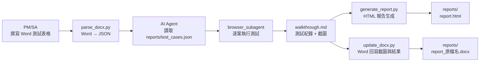

# 開發規格書：Word 驅動之自動化瀏覽器測試與雙軌報告生成系統

> **版本**：v3.1 | **更新日期**：2026-02-25  
> **前版**：[devSpec_v2.md](file:///d:/GitHub/AIGen/AutoTest/dev/devSpec_v2.md)（Markdown + AI Agent 版本）  
> **更新**：將雙軌執行引擎統一為 AI Agent + browser_subagent；`run_tests.py` 降為 deprecated

---

## 1. 專案背景與目標

本專案提供**雙軌自動化測試方案**，讓非工程人員能以最熟悉的方式啟動網站功能驗收：

| 方案 | 輸入格式 | 執行引擎 | 輸出格式 | 對應 Skill |
|---|---|---|---|---|
| **A — Markdown 路線** | `.md` 三段式結構 | AI Agent + browser_subagent | HTML 報告 | `autoTestReport` |
| **B — Word 路線** | `.docx` 測試表格 | AI Agent + browser_subagent | HTML 報告 + Word 回寫 | `browser-test-reporter` |

### 設計原則
- **零學習成本**：PM/SA 可繼續用 Word 表格撰寫測試需求，無需學習 Markdown 或程式碼
- **全自動流水線**：Word 輸入 → 解析 → 瀏覽器執行 → 截圖/錄影 → 報告生成，一鍵完成
- **報告自包含**：HTML 報告內嵌所有截圖（Base64），可獨立分享；Word 報告回寫截圖與 PASS/FAIL 狀態

---

## 2. 角色與職責

| 角色 | 職責 | 操作方式 |
|---|---|---|
| **PM / SA** | 維護測試劇本與預期結果 | 在 Word 表格中填寫測試項目、操作步驟、預期結果 |
| **QA / 執行者** | 觸發測試、檢視報告 | 在 AI 對話輸入觸發關鍵字或直接執行腳本 |
| **AI Agent / 腳本** | 解析文件、操控瀏覽器 | 自動解析 Word → JSON → 執行 Playwright → 產出報告 |

---

## 3. 系統核心流程

### 方案 B — Word 全流程（browser-test-reporter）



#### 四步驟分解

| 步驟 | 工具 / 引擎 | 輸入 | 輸出 |
|---|---|---|---|
| **Step 1 — 解析 Word** | `parse_docx.py` | `.docx` 測試文件 | `reports/test_cases.json` |
| **Step 2 — AI 執行測試** | AI Agent + browser_subagent | `reports/test_cases.json` | `reports/walkthrough.md` + 截圖 + 錄影 |
| **Step 3 — HTML 報告** | `generate_report.py` | `reports/walkthrough.md` + 截圖 | 自包含 `report.html` (至 `reports/`) |
| **Step 4 — Word 回寫** | `update_docx.py` | 原始 `.docx` + 截圖 | 含截圖與 PASS/FAIL 的 `.docx` (至 `reports/`) |

---

## 4. 測試資料範例：test2.docx

> **檔案位置**：[docs/test2.docx](file:///d:/GitHub/AIGen/AutoTest/docs/test2.docx)  
> **用途**：作為 `browser-test-reporter` 的標準測試輸入，驗證 Word 解析流程

### 文件結構摘要

`test2.docx` 包含兩個測試個案，採用**表格式**呈現（與 `word_template.md` 推薦的「格式 A」一致）：

#### 個案 1：前台介面改版

| 項目序 | 測試項目 | 操作步驟 | 預期結果 |
|---|---|---|---|
| 1 | 首頁 | 進入首頁，切換全宗範圍 | Edge, Chrome, Firefox 頁面正常呈現 |
| 2 | 全宗瀏覽 | 點選主選單→全宗瀏覽 | 頁面正常呈現 |
| 3 | 影像瀏覽器 | 點選任一筆單件內容頁 | 頁面正常呈現 |
| 4 | 網站支援各種瀏覽裝置 | 使用不同裝置開啟網頁 | 頁面正常呈現 |

#### 個案 2：前台檢索

| 項目序 | 測試項目 | 操作步驟 | 預期結果 |
|---|---|---|---|
| 1 | 關鍵字查詢 | 輸入「南方資料館」關鍵字 | 成功查詢資料 |
| 2 | 檢索驗證機制 | 單一 IP 於一定時間內進行大量檢索 | 顯示安全驗證功能 |

### parse_docx.py 預期轉換結果

```json
{
  "meta": {
    "title": "臺灣史檔案資源系統前台",
    "base_url": "https://tais.ith.sinica.edu.tw/",
    "environment": "production",
    "tested_by": "",
    "date": "2026-02-25"
  },
  "test_cases": [
    {
      "id": "TC-001",
      "name": "首頁 - 切換全宗範圍",
      "steps": [
        { "action": "goto", "target": "/" },
        { "action": "screenshot", "name": "homepage" }
      ],
      "expected_result": "Edge, Chrome, Firefox 頁面正常呈現"
    },
    {
      "id": "TC-002",
      "name": "全宗瀏覽",
      "steps": [
        { "action": "click", "target": "text=全宗瀏覽" },
        { "action": "screenshot", "name": "fonds_browse" }
      ],
      "expected_result": "頁面正常呈現"
    },
    {
      "id": "TC-005",
      "name": "關鍵字查詢",
      "steps": [
        { "action": "fill", "target": "#search-input", "value": "南方資料館" },
        { "action": "click", "target": "text=查詢" },
        { "action": "assert_visible", "target": "text=南方資料館" }
      ],
      "expected_result": "成功查詢資料"
    }
  ]
}
```

---

## 5. 功能需求清單

### 已實現功能

| # | 功能 | 狀態 | 對應元件 |
|---|---|---|---|
| F-01 | Markdown 測試案例解析與 AI 執行 | ✅ 已實現 | `autoTestReport` SKILL |
| F-02 | HTML 報告生成（Base64 內嵌） | ✅ 已實現 | `generate_report.py`（舊版） |
| F-03 | 瀏覽器全程錄影 | ✅ 已實現 | `browser_subagent` WebP 錄影 |

### 新增功能（browser-test-reporter）

| # | 功能 | 狀態 | 對應元件 |
|---|---|---|---|
| F-04 | Word 文件解析為結構化 JSON | ✅ 已完成 | `parse_docx.py` |
| F-05 | AI Agent + browser_subagent 執行 Word 測試 | ✅ 已完成 | AI Agent 統一引擎 |
| F-06 | 進階 HTML 報告（Lightbox、統計面板） | ✅ 已完成 | `generate_report.py` |
| F-07 | Word 報告回寫（截圖 + PASS/FAIL） | ✅ 已完成 | `update_docx.py` |

### 待開發功能

| # | 功能 | 說明 |
|---|---|---|
| F-08 | 測試案例格式驗證 | 檢查 Word/Markdown 文件結構是否符合規範 |
| F-09 | 批次執行模組 | 一鍵掃描多份測試文件依序執行 |
| F-10 | 測試摘要儀表板 | 彙整多份報告為統一 Pass/Fail 統計頁 |
| F-11 | 歷史紀錄追蹤 | 跨版本測試結果 diff 比對 |

---

## 6. 技術選型

| 類別 | 技術 | 用途 |
|---|---|---|
| **程式語言** | Python 3.12 | 腳本工具（parse_docx, generate_report, update_docx）|
| **Word 解析** | `pandoc` + `python-docx` | `.docx` → Markdown → JSON |
| **瀏覽器自動化** | AI Agent + browser_subagent | 自然語言 → 瀏覽器操作（雙軌統一引擎）|
| **HTML 報告** | `Jinja2` + Base64 內嵌 | 自包含單頁報告 |
| **Word 回寫** | `python-docx` + `Pillow` | 截圖插入 + 表格狀態更新 |
| **打包分發** | PyInstaller | 編譯為 `.exe` 免依賴環境 |

### 環境安裝

```bash
# Python 套件
pip install playwright python-docx Pillow jinja2 pandoc markdown

# Playwright 瀏覽器
playwright install chromium

# pandoc（系統級）
winget install --id JohnMacFarlane.Pandoc
```

---

## 7. 分階段開發步驟

### 第一階段：驗證 Word 全流程（browser-test-reporter）

> 目標：以 `docs/test2.docx` 為測試資料，端到端跑通四步驟流程

| # | 開發項目 | 說明 |
|---|---|---|
| 1-1 | 驗證 `parse_docx.py` | 用 `docs/test2.docx` 測試解析，確認產出正確的 `reports/test_cases.json` |
| 1-2 | 驗證 `run_tests.py` | 用解析出的 JSON 執行 TAIS 網站測試，確認截圖與錄影產出 |
| 1-3 | 驗證 `generate_report.py` | 確認 HTML 報告含 Lightbox、統計面板、Base64 截圖 |
| 1-4 | 驗證 `update_docx.py` | 確認 Word 回寫截圖與 PASS/FAIL 狀態正確 |
| 1-5 | 修正解析問題 | 根據 `test2.docx` 的實際格式調整 `parse_docx.py` 的啟發式解析規則 |

### 第二階段：雙軌整合與便捷性提升

| # | 開發項目 | 說明 |
|---|---|---|
| 2-1 | 統一 CLI 入口 | 建立 `autotest` 單一命令，自動判斷輸入為 `.docx` 或 `.md` 並選擇對應流程 |
| 2-2 | SKILL 整合觸發 | 在 AI 對話中自動辨識使用者提供的 Word 檔並啟動 `browser-test-reporter` |
| 2-3 | 批次執行 | 支援 `autotest --batch docs/` 掃描並依序執行所有測試文件 |
| 2-4 | 報告產生器統一 | 統一兩條路線的 HTML 報告樣式，保持一致的視覺呈現 |

### 第三階段：進階功能

| # | 開發項目 | 說明 |
|---|---|---|
| 3-1 | 測試摘要儀表板 | 彙整所有報告為一頁 Pass/Fail 統計表 |
| 3-2 | 歷史紀錄追蹤 | 報告版本戳記 + 跨版本結果 diff |
| 3-3 | Word 範本生成器 | 自動產出空白 `.docx` 測試範本供 PM/SA 填寫 |
| 3-4 | CI/CD 整合 | GitHub Actions 排程自動執行 + 報告歸檔 |

---

## 8. Word 測試文件撰寫規範

### 支援的表格格式

PM/SA 在 Word 中需以**表格**呈現測試案例，系統支援兩種格式：

**格式 A — 多欄表格（推薦，`test2.docx` 使用此格式）**

| 項目序 | 測試項目 | 操作步驟 | 預期結果 | 測試結果 |
|---|---|---|---|---|
| 1 | 首頁 | 進入首頁 | 頁面正常呈現 | □通過 □失敗 |

**格式 B — 條列式**

每個案例以 `TC-001` 格式編號，步驟用條列文字描述。

### 步驟描述關鍵字（AI 自動識別）

| 中文關鍵字 | 對應操作 | 範例 |
|---|---|---|
| 前往、開啟、進入 | `goto` | 進入首頁 |
| 點擊、點選、按下 | `click` | 點選主選單→全宗瀏覽 |
| 輸入、填入 | `fill` | 輸入「南方資料館」關鍵字 |
| 選擇、選取、切換 | `select` | 切換全宗範圍 |
| 確認、驗證 | `assert_visible` | 確認頁面正常呈現 |
| 等待 | `wait` | 等待頁面載入 |

### 注意事項

1. **不需要寫程式碼** — 用自然語言描述操作即可
2. **CSS 選擇器選用** — 若知道按鈕 ID 可直接寫（如 `#login-btn`），否則用文字描述
3. **截圖自動產生** — 系統在每個步驟後自動截圖，無需手動標記
4. **測試帳密** — 直接寫在表格中或在文件開頭的基本資訊區塊標明

---

## 9. 專案目錄結構

```
AutoTest/
├── README.md                           ← 📖 專案入口（非工程人員）
├── SOP.md                              ← 📖 操作手冊
├── docs/
│   ├── test2.docx                      ← 📝 Word 測試資料（PM/SA 填寫）
│   └── architecture.md                 ← 🔧 系統架構圖
├── Test/                               ← 📝 Markdown 測試案例
├── reports/                            ← 📊 測試產出總目錄（含 HTML 報告、截圖、JSON 等）
├── dev/                                ← 🔧 開發規格文件
│   ├── devSpec_v1.md                   ← 原始 Word 驅動構想
│   ├── devSpec_v2.md                   ← Markdown + AI Agent 版本
│   └── devSpec_v3.md                   ← 本文件（雙軌整合版）
├── .agent/
│   ├── skills/autoTestReport/          ← 🤖 方案 A — Markdown 路線 Skill
│   ├── skills/browser-test-reporter/   ← 🤖 方案 B — Word 路線 Skill
│   │   ├── SKILL.md
│   │   ├── scripts/
│   │   │   ├── parse_docx.py
│   │   │   ├── run_tests.py
│   │   │   ├── generate_report.py
│   │   │   └── update_docx.py
│   │   └── references/
│   │       ├── report_spec.md
│   │       ├── word_template.md
│   │       └── writing_guide.md
└── .github/                            ← 🔧 CI/CD 設定
```
