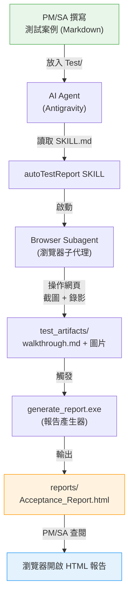
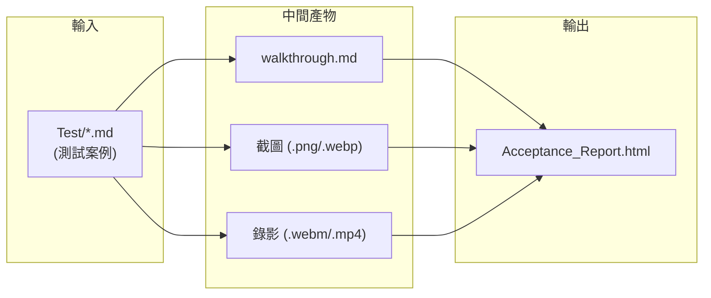

# 系統架構設計

本文件說明 AutoTest 自動化驗收測試系統的架構設計與元件互動方式，供工程人員維護與擴充參考。

---

## 系統流程總覽



---

## 元件職責

### 1. 測試案例 (`Test/*.md`)

| 項目 | 說明 |
|---|---|
| 格式 | Markdown 三段式結構 |
| 撰寫者 | PM / SA |
| 結構 | `[階段一]` 目標 → `[執行步驟]` 操作 → `[預期結果]` 驗證 |
| 關鍵標記 | `自動化紀錄點`：標示需截圖的位置 |

### 2. autoTestReport SKILL (`.agent/skills/autoTestReport/SKILL.md`)

| 項目 | 說明 |
|---|---|
| 角色 | AI Agent 的行為定義藍圖 |
| 觸發方式 | 使用者輸入關鍵字（`/test`、`執行驗收` 等） |
| 執行流程 | 初始化 → 瀏覽器自動化 → 紀錄撰寫 → 呼叫報告產生器 |

### 3. Browser Subagent（瀏覽器子代理）

| 項目 | 說明 |
|---|---|
| 角色 | 執行實際的瀏覽器操作 |
| 輸入 | 測試案例中的步驟與紀錄點指示 |
| 輸出 | WebP 錄影檔 + DOM 截圖 |
| 存放位置 | `.agent/test_artifacts/` |

### 4. 報告產生器 (`generate_report.exe` / `generate_report.py`)

| 項目 | 說明 |
|---|---|
| 輸入 | `.agent/test_artifacts/walkthrough.md` + 圖片/影片 |
| 處理 | Markdown → HTML 轉換，圖片 Base64 內嵌 |
| 輸出 | `reports/Acceptance_Report_{時間戳記}.html` |
| 特點 | 報告為自包含 HTML（所有媒體檔內嵌），可獨立分享 |

---

## 資料流向



---

## 擴充指引

### 新增 SKILL

1. 在 `.agent/skills/` 下建立新資料夾
2. 建立 `SKILL.md`，定義 YAML Frontmatter（`name`、`description`）
3. 依據三段式結構撰寫觸發條件、執行步驟與預期結果

### 自訂報告樣式

修改 `dev/generate_report.py` 中的 `<style>` 區塊即可調整 HTML 報告的視覺呈現。修改後需重新編譯 EXE：

```bash
pyinstaller --onefile dev/generate_report.py -n generate_report \
  --distpath .agent/skills/autoTestReport/scripts/
```

### 整合 CI/CD

`.github/workflows/` 已預留 CI/CD 設定目錄，可加入：
- 測試案例格式驗證（check Markdown 三段式結構）
- 報告產生器單元測試
- 自動化排程測試
